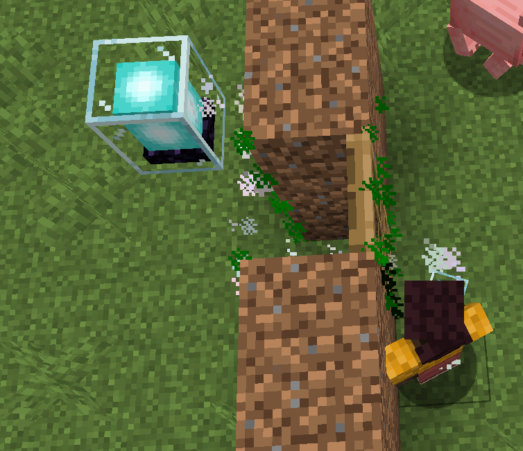
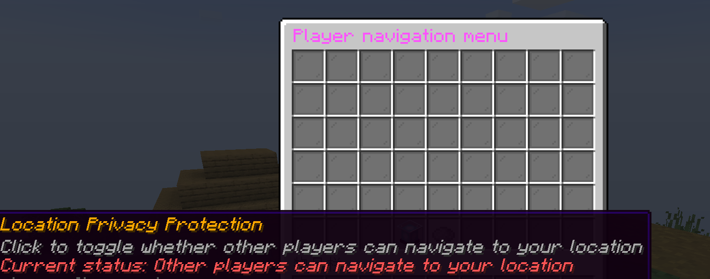

## ::mdi:play-box-outline:: 效果演示

导航时的粒子效果：

导航菜单界面（使用 `/toc cd` 打开）：

## ::mdi:console-line:: 玩家常用指令

### 打开主菜单

这是最核心的指令，所有功能都可以在菜单中完成。

- **`/toc cd`**：打开玩家导航菜单。

### 路径点管理

您可以将当前位置保存为路径点，方便以后快速导航回来。

- **`/toc nav add <路径点名称>`**
  - ::mdi:plus-circle /#4CAF50:: 在您当前的位置创建一个新的路径点。
  - _示例：`/toc nav add home`_

- **`/toc nav go <路径点名称>`**
  - ::mdi:run /#2196F3:: 开始导航至您指定的路径点。
  - _示例：`/toc nav go home`_

- **`/toc nav stop`**
  - ::mdi:stop-circle /#FF9800:: 停止当前的导航。

- **`/toc nav list`**
  - ::mdi:format-list-bulleted:: 查看所有您已创建的路径点列表。

- **`/toc nav remove <路径点名称>`**
  - ::mdi:delete /#F44336:: 删除一个已创建的路径点。
  - _示例：`/toc nav remove old_base`_

- **`/toc nav rename <旧名称> <新名称>`**
  - ::mdi:pencil:: 重命名一个路径点。
  - _示例：`/toc nav rename home sweet_home`_

### 其他指令

- **`/toc lang <语言代码>`**
  - ::mdi:web:: 切换插件的显示语言。
  - _可用语言：`zh-CN`（简体中文）、`zh-TW`（繁體中文）、`en-US`（英语）等。_
  - _示例：`/toc lang en-US`_

## ::mdi:alert-circle-outline /orange:: 注意事项

- ::mdi:karate:: 本功能不适用于高精度的跑酷寻路。
- ::mdi:ladder:: 目前，攀爬类的寻路仅支持梯子和脚手架。
- ::mdi:water-off:: 在水下的寻路可能会出现一些意料之外的情况，请谨慎使用。

如果您在使用中遇到任何问题，欢迎向服主和管理员反馈！
